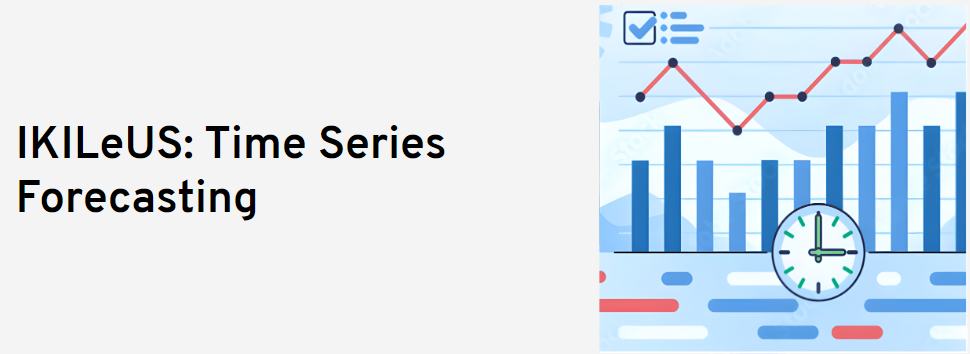

## Table of Contents
1. [Description](#description)
2. [Information](#information)
4. [Certificate](#certificate)

## Description

Future knowledge is essential for planning and strategy development. In particular, when businesses operate according to specific trends and patterns that can be drawn from history. Time series forecasting is a technique for analyzing and extracting the underlying patterns that can be used to predict future outcomes. The primary value of using time series for forecasting is that at business time, future scores and events are not fully available and can only be estimated using historical data. This technology is crucial in many areas to predict numerous economic variables and adapt business plans according to future requirements. Time series forecasting has important applications in weather forecasting, business, healthcare, and finance.

In this course you will acquire basic knowledge of various Time Series Forecasting topics: Long Short-Term Memory (LSTM), Exponential Smoothing, Autoregressive integrated moving average (ARIMA), TBATS, Multivariate Time Series Forecasting, XGboost, N_BEATS, Prophet. The theoretical knowledge in this course is deepened through practical examples and hands-on exercises. For this purpose, different datasets are used to represent different business areas such as healthcare, customer service, e-commerce, etc.

This course provides you with an HPC platform for running python codes using the HLRS training cluster. All algorithms and practical exercises for this course are implemented in Python, which offers a wide range of libraries to support AI applications. The course is also an excellent opportunity to exchange knowledge and ideas with participants and lecturers.

This course is organized via the [HLRS Supercomputing Academy](https://www.hlrs.de/training/supercomputing-academy).

## Information

The overall goals of this course were the following:
> - learn the fundamentals of time series forecasting analysis.
> - gain knowledge of different algorithms and methods in time series forecasting.
> - gain basic skills in data preprocessing, data cleaning and preparation.
> - learn how to build a variety of time series forecasting models and optimize hyperparameters. In addition to interpreting and visualizing the results.
> - deepen your understanding of different models and algorithms through hands-on exercises and assignments.

More detailed information and links for the course can be found on the [course website](https://www.hlrs.de/training/2024/ikileus-tsf).

## Certificate

The certificate for the workshop can be found below:

["IKILeUS: Time Series Forecasting" - HLRS Supercomputing Academy]() (Issued On: November 2024)
